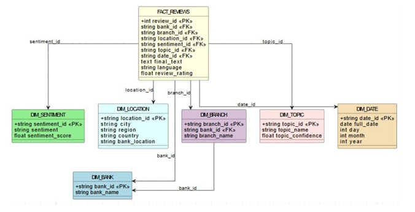
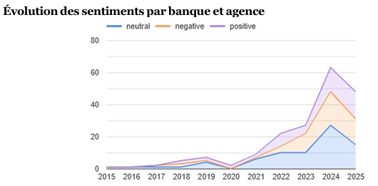
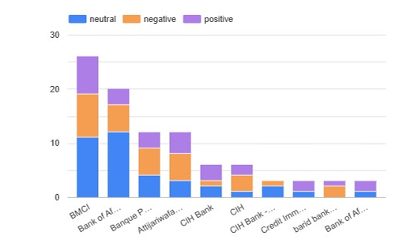
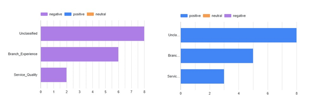
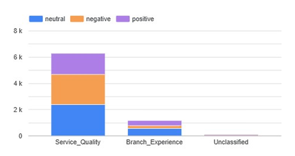
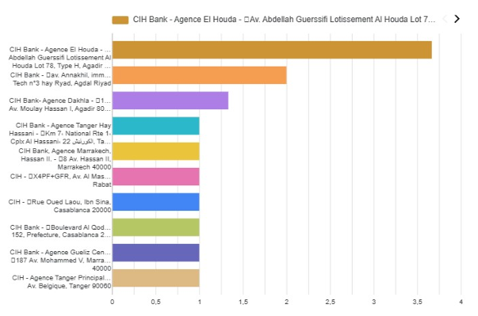
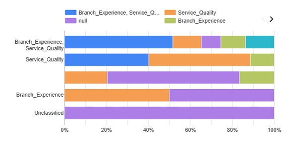
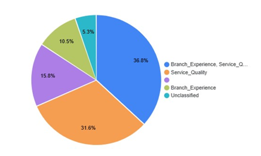
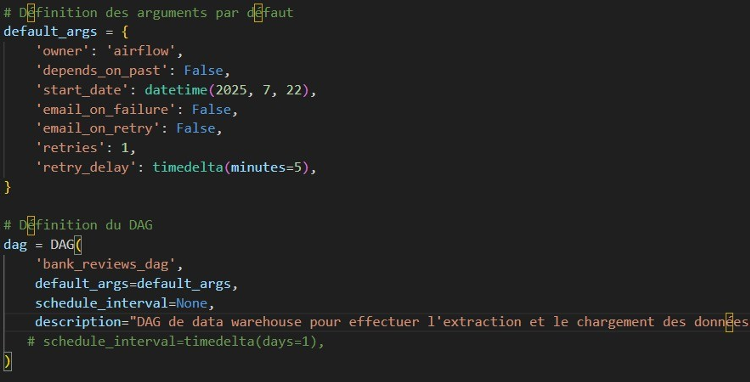
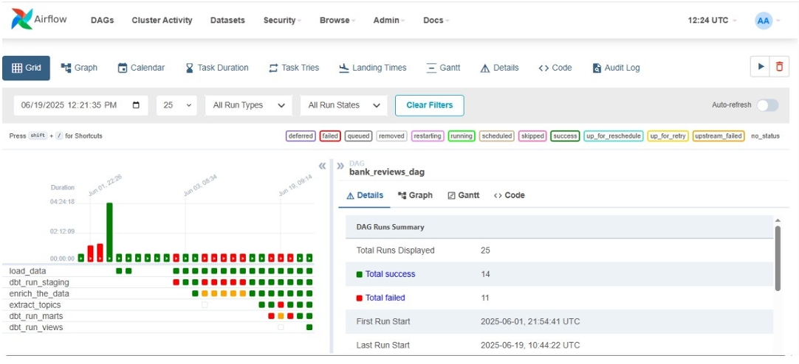

# Bank Reviews Data Warehouse Project
## Project Overview
Analyzing Customer Reviews of Bank Agencies in Morocco using a Modern Data Stack
This project implements a comprehensive data pipeline to collect, process, and analyze Google Maps reviews for bank agencies in Morocco. The goal is to extract valuable insights using sentiment analysis, topic modeling, and customer experience metrics.

## Objectives

- Collect customer reviews from Google Maps for Moroccan bank agencies
- Process unstructured review data through modern ETL pipelines
- Analyze sentiment trends and customer satisfaction patterns
- Visualize insights through interactive dashboards
- Automate the entire data pipeline for continuous monitoring

##  Technology Stack

| Step                  | Tools / Technologies Used                 |
|-----------------------|-------------------------------------------|
| Data Extraction       | Python, Google Maps API, Scrapy, Selenium |
| Orchestration         | Apache Airflow                            |
| Storage               | PostgreSQL                                |
| Transformation        | DBT (Data Build Tool)                     |
| Analysis & BI         | Looker Studio (Google Data Studio)        |
| Version Control       | Git, GitHub                               |

## Folder Structure
```bash
bank_reviews_dw_project/                # Main directory
├── data/                               # Raw and processed data files
│
├── airflow/                            # Airflow setup for pipeline orchestration
│   ├── dags/                           # DAG scripts for data collection and transformation
│   └── logs/                           # Execution logs from Airflow tasks
│
├── scripts/                            # Python scripts for scraping, cleaning, and enrichment (NLP)
│
├── projet_dbt/                         # DBT project for data transformation and modeling
│   ├── analyses/                       # Optional ad hoc analysis SQL files
│   ├── dbt_packages/                   # DBT dependencies (installed packages)
│   ├── logs/                           # DBT execution logs
│   ├── macros/                         # Custom DBT macros (reusable SQL functions)
│   ├── models/                         # Main transformation logic (SQL models)
│   │   ├── staging/                    # Initial cleaned models from raw data
│   │   └── marts/                      # Final fact and dimension models (star schema)
│   ├── seeds/                          # Static CSV datasets loaded into the warehouse
│   ├── snapshots/                      # Historical snapshots of slowly changing data
│   ├── target/                         # Compiled DBT outputs and artifacts
│   └── tests/                          # DBT tests for data quality and integrity
│
├── dashboards/                         # Looker Studio configs, links, or screenshots of dashboards
│
└── docs/                               # Project documentation, reports, and setup guides
```
###  Project Roadmap 

| **Phase** | **Focus**                           | **Key Deliverables**                                                                 |
|-----------|-------------------------------------|---------------------------------------------------------------------------------------|
| ✅ Phase 1 | **Data Collection**                 | - Google Maps scraping/API scripts<br>- Raw reviews stored in `/data/`<br>- Airflow DAG in `/airflow/dags/` to automate collection |
| ✅ Phase 2 | **Data Cleaning & Enrichment**      | - Text normalization, language detection, sentiment analysis, topic modeling (scripts in `/scripts/`)<br>- DBT staging models in `/projet_dbt/models/staging/` |
| ✅ Phase 3 | **Data Modeling (Star Schema)**     | - DBT marts models (`fact_reviews`, `dim_*`) in `/projet_dbt/models/marts/`<br>- SQL star schema in `/sql/` |
| ✅ Phase 4 | **Data Analytics & Dashboards**     | - Looker Studio dashboards linked in `/dashboards/`<br>- KPIs: sentiment trends, top topics, branch ranking |
| ✅ Phase 5 | **Pipeline Automation**             | - Airflow DAGs for regular updates (collection & DBT runs)<br>- Error alerting and scheduling setup |
| ✅ Phase 6 | **Documentation & Final Report**    | - Full documentation in `/docs/`<br>- Final report and presentation<br>- Clean `README.md` for GitHub |

## Phase 1: Data Collection (Scraping Google Maps Reviews)

### 1. Data Extraction

The Python script  [`google_maps_scraper.py`](./scripts/google_maps_scraper.py) is used to extract reviews of Moroccan bank branches via:
- **Web Scraping** using **BeautifulSoup** or **Selenium**

#### ✅ Extracted Fields:
```json

{
  "bank_name": "Bank name",
  "branch_name": "Branch name",
  "location": "Address/GPS",
  "review_text": "Review text",
  "rating": "Rating (1-5)",
  "review_date": "YYYY-MM-DD"
}
```
### 2. Automation with Apache Airflow
The extraction process is automated using an Airflow DAG defined in bank_reviews_dag.py.
This DAG enables: 

**Scheduling** the scraping script to run daily or weekly
**Automating the entire pipeline**
**Automatically loading** the raw extracted data into PostgreSQL (table stg_google_maps_reviews)

#### Example tasks in the DAG:

```python
from airflow.operators.python_operator import PythonOperator

extract_task = PythonOperator(
    task_id='extract_data',
    python_callable=extract_maps.extract,
    dag=dag,
)

load_task = PythonOperator(
    task_id='load_data',
    python_callable=load,
    dag=dag,
)
```
## Phase 2: Data Cleaning & Transformation

### 1. Data Cleaning (DBT & SQL)

- Remove duplicate reviews using SQL window functions or DBT tests.

- Text normalization:
  - Convert to lowercase.
  - Remove punctuation and special characters.
  - Eliminate stop words (e.g., using NLTK or custom SQL regex).

- Handle missing values:
  - Impute or flag null ratings/text (e.g., `rating IS NULL`).

---

### 2. Data Enrichment

- **Language detection**:
  - Use Python libraries (e.g., `langdetect`) or PostgreSQL extensions (e.g., `pg_trgm`).

- **Sentiment analysis**:
  - Classify reviews as Positive/Neutral/Negative (e.g., with `TextBlob` or `VADER`).

- **Topic modeling (LDA)**:
  - Extract key topics from reviews (e.g., "service speed," "staff attitude").
  - Implemented via Python (`scikit-learn`) or SQL UDFs.

```bash
├── 📄 projet_dbt/models/staging/stg_reviews_cleaned.sql   # SQL transformations
├── 📄 projet_dbt/macros/normalize_text.sql                # SQL text processing
├── 📄 scripts/multilingual_sentiment_analysis.py          # Sentiment classification
└── 📄 scripts/topic_modeling.py                           # LDA implementation
```
### 3. Automation with Airflow - Running DBT models

Example Airflow task to run DBT staging models:
```python
from airflow.operators.bash_operator import BashOperator

dbt_run_staging = BashOperator(
    task_id='dbt_run_staging',
    bash_command='cd ~/reviews_prouject/dbt_project/outputs && dbt run --models stg_reviews_cleaned'
)
```
## Phase 3: Data Modeling (Star Schema in PostgreSQL)

### Dimension Tables  
Files: `dim_bank.sql`, `dim_branch.sql`, `dim_location.sql`, `dim_sentiment.sql`

**Role:** Create dimension tables (`bank_id`, `branch_id`, `location_id`, `sentiment_id`) with primary keys and distinct data sourced from `cleaned_reviews`.

---

### Fact Table  
File: `fact_reviews.sql`

**Role:** Build the fact table `fact_reviews` by joining the dimension tables, generating the primary key `fact_review_id`, and defining foreign key relationships.

###  Load Data into PostgreSQL

Once the data modeling is designed, the transformation logic is implemented in DBT to create and populate the dimension and fact tables. DBT allows building reusable SQL models that structure and clean the data according to the star schema design.

The entire process is automated with Apache Airflow, which orchestrates the data ingestion pipeline to ensure that fresh, cleaned, and modeled data is regularly loaded into the PostgreSQL database.

### Data Model Diagram

The diagram below illustrates the star schema design of our data mart, showing the central fact table (`fact_reviews`) connected to its surrounding dimension tables (`dim_bank`, `dim_branch`, `dim_location`, and `dim_sentiment`). This structure enables efficient querying and insightful analytics on customer reviews by different attributes.



# Phase 4: Data Analytics & Reporting
## 1. Looker Studio Dashboards
This phase focuses on analyzing the transformed and modeled data by creating interactive dashboards in Looker Studio.

These dashboards provide clear, dynamic, and customized visual insights to support decision-making.

The visualizations are built around the following key areas:



This area chart shows the number of customer reviews by sentiment (Positive, Negative, Neutral) from 2015 to 2025.

It highlights:
- A steady rise in positive reviews since 2019
- A peak in negative reviews around 2021–2022
- A stable trend in neutral reviews
Overall, it reflects improving customer satisfaction over time.

### Sentiment Distribution by Bank (June 2025)



This chart shows customer review sentiment by bank in Morocco (as of June 21, 2025).  
Banque Populaire and Attijariwafa Bank have the most reviews, mostly Neutral.  
CIH Bank and Bank of Africa have fewer reviews, mainly Neutral and Positive.

### Sentiment Breakdown by Review Topics in Moroccan Banks


### Review Volume by Topics and Sentiment in Morocco


### CIH Bank Branch Performance by Customer Satisfaction
This chart ranks CIH Bank branches based on the share of positive reviews.  
It highlights the top- and lowest-performing branches in terms of customer satisfaction.


### Topic Distribution by Category and Percentage in Morocco


### Proportional Distribution of Bank Review Topics in Morocco


## Phase 5: Deployment and Automation

### Orchestration with Apache Airflow

The entire pipeline automation uses Apache Airflow to orchestrate the different tasks:




The customer review analysis pipeline for Moroccan bank branches is fully automated using Apache Airflow.

This workflow handles daily review collection from Google Maps, data cleaning (removing duplicates, text normalization), NLP enrichment (sentiment analysis and topic detection), and loads the data into PostgreSQL using a star schema.

It supports multiple languages (Arabic, French, English) and sends alerts if many negative reviews are detected.

The Airflow interface allows teams to monitor data collection, NLP quality, API issues, and pipeline performance.

This automation ensures up-to-date insights on customer satisfaction, helping banks respond quickly and improve their services.

